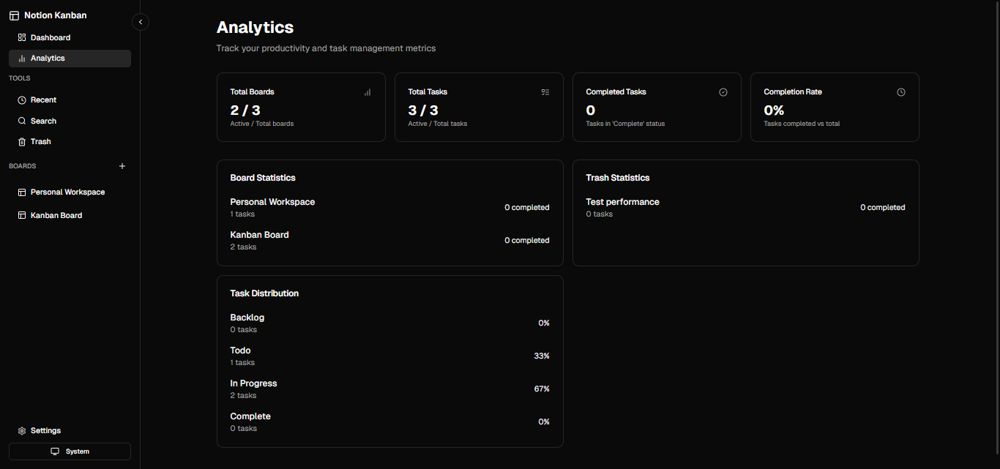

# Notion Kanban
<div align="center">



A powerful, Notion-inspired Kanban board application built with modern web technologies.

[](https://nextjs.org/)
[](https://www.typescriptlang.org/)
[](LICENSE)
[](CONTRIBUTING.md)

[Demo](https://demo-link.com) • [Documentation](README.md) • [Report Bug](https://github.com/Ibrahimkhan799/kanban-board/issues) • [Request Feature](https://github.com/Ibrahimkhan799/kanban-board/issues)

</div>

## ✨ Features

### Core Features
- 🎯 **Advanced Drag & Drop** - Smooth, intuitive card and board management
- 🌓 **Theming System** - Light/Dark mode with customizable color schemes
- 📱 **Responsive Design** - Optimized for all devices with adaptive layouts
- ⌨️ **Command Palette** - Quick actions with keyboard shortcuts (⌘/Ctrl + K)

### Additional Features
- 🔄 **Real-time Collaboration** - Live updates powered by Supabase
- 🎨 **Custom Themes** - Personalized board and card appearances
- 🔍 **Smart Search** - Full-text search across all boards and cards
- 📊 **Analytics Dashboard** - Track productivity and board metrics
- 🔐 **Authentication** - Secure user authentication with Supabase

## 🚀 Tech Stack

### Frontend
- **Framework:** [Next.js 14](https://nextjs.org/) (App Router)
- **Language:** [TypeScript](https://www.typescriptlang.org/)
- **Styling:** [Tailwind CSS](https://tailwindcss.com/)
- **Components:** [Radix UI](https://www.radix-ui.com/)
- **Animations:** [Framer Motion](https://www.framer.com/motion/)
- **Icons:** [Lucide React](https://lucide.dev/)

### Backend & State
- **Database:** [Supabase](https://supabase.com/)
- **State Management:** [Zustand](https://zustand-demo.pmnd.rs/)
- **Real-time:** Supabase Realtime

## 🛠️ Installation

### Prerequisites
- Node.js 18+ 
- npm/yarn/pnpm
- Supabase account

### Setup Steps

1. **Clone the repository**
```bash
git clone https://github.com/Ibrahimkhan799/notion-kanban.git
cd notion-kanban
```

2. **Install dependencies**
```bash
npm install
# or
yarn install
# or
pnpm install
```

3. **Environment Setup**
Create a `.env.local` file:
```bash
NEXT_PUBLIC_SUPABASE_URL=your_supabase_url
NEXT_PUBLIC_SUPABASE_ANON_KEY=your_supabase_anon_key
NEXT_PUBLIC_APP_URL=http://localhost:3000
```

4. **Start Development Server**
```bash
npm run dev
```

5. Open [http://localhost:3000](http://localhost:3000)

## 📁 Project Structure

```
notion-kanban/
├── app/
│   ├── board/
│   │   ├── [id]/
│   │   │   └── useUpdateMetadata.ts  # Board metadata hook
│   │   └── settings/
│   │       ├── page.tsx              # Settings page
│   │       └── loading.tsx           # Settings loading state
│   ├── signup/
│   │   └── page.tsx                  # Signup page
│   └── layout.tsx                    # Root layout
├── components/
│   ├── ui/
│   │   ├── sidebar.tsx               # Sidebar component
│   │   ├── switch.tsx                # Switch component
│   │   ├── sheet.tsx                 # Sheet component
│   │   └── ...                       # Other UI components
│   ├── NotionKanban.tsx             # Main Kanban board
│   ├── board-name.tsx               # Board name component
│   └── theme-color-radio.tsx        # Theme color selector
├── lib/
│   ├── auth.ts                      # Authentication functions
│   ├── constants.ts                 # App constants
│   ├── store.ts                     # Zustand store
│   ├── types.ts                     # TypeScript types
│   ├── utils.ts                     # Utility functions
│   └── hooks/
│       └── useAuth.ts               # Auth hook
├── hooks/
│   ├── use-toast.ts                 # Toast notifications
│   ├── use-mobile.tsx               # Mobile detection
│   └── use-theme.ts                 # Theme management
```

## 🎯 Key Features Explained

### Drag and Drop System
Our drag-and-drop implementation uses a custom solution built on Framer Motion, providing:
- Smooth animations
- Touch device support
- Automatic reordering
- Cross-board movements

### Real-time Collaboration
- Live updates using Supabase Realtime
- Conflict resolution
- Presence indicators
- Activity history

### Performance Optimizations
- Incremental Static Regeneration
- Dynamic imports
- Image optimization
- Edge runtime support

## 📄 License

Licensed under the MIT License. See [LICENSE](LICENSE) for details.

## 🙏 Acknowledgments

- [Next.js](https://nextjs.org/) - The React Framework
- [Radix UI](https://www.radix-ui.com/) - UI Component System
- [Tailwind CSS](https://tailwindcss.com/) - CSS Framework
- [Supabase](https://supabase.com/) - Backend Infrastructure
- [Vercel](https://vercel.com/) - Deployment Platform

## 📫 Support & Contact

- Documentation - [README.md](README.md)
- Issues - [GitHub Issues](https://github.com/Ibrahimkhan799/kanban-board/issues)
- Email - ibrah.khan799@gmail.com
- Dribble - [@ibrahim_khan799](https://dribbble.com/Ibrahim_khan799)

---

<div align="center">
Made with ❤️ by Ibrahim Khan (https://github.com/Ibrahimkhan799)
</div>